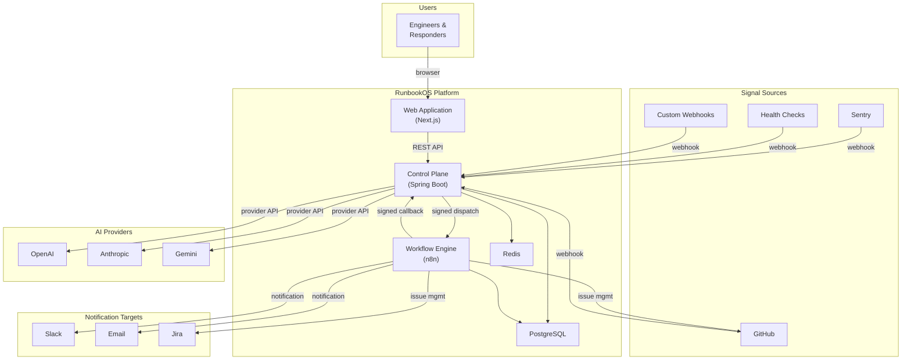
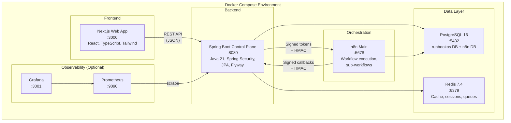

# RunbookOS Architecture

## System Context

RunbookOS sits between incident signal sources and engineering teams, providing automated triage, AI-assisted analysis, and human-governed remediation.

## Container Architecture

## Key Architectural Decisions

### 1. Separation of Control Plane and Orchestration

**Decision**: Spring Boot owns authorization, policy, and state. n8n handles workflow orchestration.

**Rationale**: This separation ensures that the AI and workflow engine can never bypass security controls. The Java policy engine evaluates every action classification before n8n is allowed to execute. n8n execution success is never treated as authorization proof.

### 2. Signed Internal Communication

**Decision**: All communication between Spring Boot and n8n uses HMAC-signed tokens with expiry and nonce.

**Rationale**: Prevents unauthorized workflow execution even if n8n is compromised. Every execution request carries a short-lived token scoped to specific action IDs.

### 3. Immutable Audit Trail

**Decision**: Every state transition, approval decision, and action execution creates an immutable audit event.

**Rationale**: Provides complete incident timeline replay and accountability. Required for post-incident review and compliance.

### 4. Multi-Tenant Organization Isolation

**Decision**: All data is scoped to organizations at the service and repository layers.

**Rationale**: Prevents cross-tenant data access. Enforced at the database query level, not just the UI.

### 5. AI as Advisory Only

**Decision**: AI generates analysis and recommendations but never makes authorization decisions.

**Rationale**: Human oversight is required for all consequential actions. The AI cannot approve its own recommendations, execute tools directly, or bypass the policy engine.

## Technology Stack

| Layer | Technology | Version |
|:------|:-----------|:--------|
| Frontend | Next.js (App Router) | 16.x |
| Frontend Language | TypeScript (strict) | 5.x |
| Styling | Tailwind CSS | 4.x |
| UI Primitives | Radix UI | Latest |
| State/Fetching | TanStack Query | Latest |
| Backend | Spring Boot | 4.1.x |
| Backend Language | Java | 21 LTS |
| Backend Framework | Spring Framework | 7.x |
| Database | PostgreSQL | 16 |
| Cache/Queue | Redis | 7.4 |
| Migrations | Flyway | Latest |
| Orchestration | n8n (self-hosted) | 2.30.x |
| Containerization | Docker Compose | v2 |
| API Documentation | springdoc OpenAPI | 2.8.x |
| Resilience | Resilience4j | Latest |
| Observability | Micrometer + OpenTelemetry | Latest |

## Data Flow

### Incident Lifecycle

1. **Signal Ingestion** — External webhook arrives at Spring Boot
2. **Verification** — Signature validation, replay protection, idempotency check
3. **Normalization** — Signal mapped to common incident model
4. **Deduplication** — Fingerprint comparison against recent signals
5. **Grouping** — Related signals grouped into existing incidents
6. **Evidence Collection** — n8n workflows gather diagnostic data
7. **AI Analysis** — Evidence sent to AI provider (secrets redacted)
8. **Runbook Recommendation** — AI suggests remediation steps
9. **Policy Evaluation** — Java policy engine classifies each action
10. **Human Approval** — Reversible/high-risk actions require approval
11. **Execution** — Approved actions executed via n8n
12. **Monitoring** — Post-action health verification
13. **Resolution** — Incident closed with structured postmortem

### Action Risk Classification

| Classification | Behaviour |
|:---------------|:----------|
| READ_ONLY | Auto-execute after policy validation |
| REVERSIBLE | Requires at least one authorized approval |
| HIGH_RISK | Requires elevated approval, typed confirmation, disabled in Demo Mode |
| PROHIBITED | Never executes |

## Implemented Phase 2–4 Control Flow

1. Users authenticate with short-lived access tokens and rotating server-side refresh sessions.
   Organization membership is re-read for authorization-sensitive operations.
2. Signed Sentry, GitHub, custom, or demo signals pass timestamp, nonce, payload-size, JSON
   validation, and recursive redaction checks before persistence.
3. A stable fingerprint creates an incident or groups the signal into a recent active incident
   inside the same organization.
4. Starting a versioned workflow creates the execution, steps, initial event, and outbox dispatch
   in one database transaction.
5. The outbox processor signs a short-lived token containing only the execution, organization,
   nonce, and allowed action identifiers, then dispatches it to n8n.
6. n8n validates the signed request and token. Each callback is independently signed and protected
   by a one-time nonce.
7. Spring Boot checks every callback action against the original allowlist before changing state.
   Persisted events are delivered as an SSE snapshot followed by live updates.

n8n success is never authorization proof. PostgreSQL-backed Java state and policy checks remain
authoritative.
