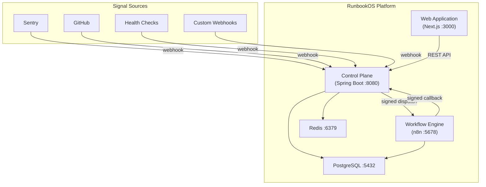

# RunbookOS

**Human-Governed AI Incident Response Platform**

RunbookOS receives production incident signals, collects diagnostic evidence, generates AI-grounded analysis, recommends runbooks, and executes remediation with **human approval**.

---

## Key Capabilities

- **Signal ingestion** — Receive webhooks from Sentry, GitHub, health checks, and custom sources
- **Deduplication & grouping** — Fingerprint events, deduplicate, group related signals into incidents
- **Evidence collection** — Gather logs, deployments, commits, service health via n8n workflows
- **AI analysis** — Evidence-grounded analysis with cited sources; hypotheses labeled as such
- **Runbook recommendations** — AI suggests; humans decide; policy engine enforces
- **Human-in-the-loop approvals** — READ_ONLY auto-executes, REVERSIBLE needs approval, HIGH_RISK needs multi-user elevated approval
- **Immutable audit trail** — Every state transition, decision, and action is permanently recorded
- **Postmortem generation** — Structured post-incident reports from the complete timeline

## Why Java and n8n are Separated

**Spring Boot (Java)** owns: authorization, policy enforcement, state machine, audit, data persistence, and all security decisions. The AI and workflow engine can never bypass security controls.

**n8n** owns: workflow orchestration, evidence collection, external integrations, notifications, and approved action execution — all gated by short-lived signed tokens issued by Spring Boot.

This means n8n execution success is never treated as authorization proof. Every sensitive action is evaluated by the Java policy engine before n8n is permitted to proceed.

## Architecture



## Quick Start

### Prerequisites

- Java 21 (Eclipse Temurin recommended)
- Node.js 22 LTS
- Docker and Docker Compose v2

### 1. Clone and configure

```bash
git clone https://github.com/your-username/runbookos.git
cd runbookos
cp .env.example .env
```

Edit `.env` with your values (or leave defaults for local development).

### 2. Start infrastructure

```bash
docker compose up -d postgres redis n8n
```

### 3. Start the backend

```bash
cd services/control-plane
./gradlew bootRun
# or on Windows: .\gradlew.bat bootRun
```

Backend starts on http://localhost:8080  
Health check: http://localhost:8080/api/health  
OpenAPI UI: http://localhost:8080/api/swagger-ui

### 4. Start the frontend

```bash
cd apps/web
npm install
npm run dev
```

Frontend starts on http://localhost:3000

### 5. Access n8n

http://localhost:5678 (credentials in your `.env`)

### One-command startup (all services)

```bash
docker compose up
```

This builds and starts all services including the backend and frontend.

## Demo Mode

RunbookOS works fully in Demo Mode without any paid services or external credentials:

1. Start the application locally
2. Navigate to http://localhost:3000
3. Create an account and organization
4. Use the Demo Incident Launcher to trigger a sample incident
5. Observe AI analysis (uses deterministic demo analyzer)
6. Approve a simulated action
7. Review the postmortem

## Environment Setup

See `.env.example` for all environment variables with documentation. Key variables:

| Variable | Description |
|:---------|:------------|
| `POSTGRES_PASSWORD` | PostgreSQL password |
| `N8N_ENCRYPTION_KEY` | n8n credential encryption key |
| `N8N_BASIC_AUTH_PASSWORD` | n8n UI password |
| `INTERNAL_HMAC_SECRET` | Spring Boot ↔ n8n signing secret |
| `JWT_SECRET` | JWT signing secret (Phase 2) |

## Test Commands

```bash
# Backend
cd services/control-plane
./gradlew test               # Run all tests
./gradlew spotlessCheck      # Check formatting
./gradlew build              # Compile and test

# Frontend
cd apps/web
npm run lint                 # ESLint
npm run type-check           # TypeScript strict check
npm run build                # Production build
```

## Security Model

- **AI is advisory only** — never makes authorization decisions
- **Java policy engine** — final authority for all authorization
- **Human-in-the-loop** — reversible/high-risk actions require human approval
- **Organization isolation** — all data scoped to organizations
- **Immutable audit trail** — complete incident timeline replay
- **Encrypted secrets** — sensitive integration fields encrypted at rest
- **Never returned** — secret values are never returned after creation

See [SECURITY.md](SECURITY.md) and [docs/security/](docs/security/) for details.

## Limitations

- Phase 1: Foundation only — incident management, AI analysis, and runbooks are implemented in later phases
- Demo Mode uses a deterministic AI analyzer (no external model required)
- High-risk actions are disabled in Demo Mode
- No Kubernetes deployment (documented as future target)

## Roadmap

| Phase | Description | Status |
|:------|:------------|:-------|
| 1 | Foundation, Architecture, Design System | 🔄 In Progress |
| 2 | Identity, Multi-Tenancy, Security, Data Model | ⬜ |
| 3 | Incident Ingestion, Deduplication, Triage | ⬜ |
| 4 | n8n Orchestration, Execution Engine | ⬜ |
| 5 | Evidence-Grounded AI Analysis | ⬜ |
| 6 | Runbooks, Policy Engine, Human Approval | ⬜ |
| 7 | Integrations, Complete Incident Workflow | ⬜ |
| 8 | Reliability, Security, Observability | ⬜ |
| 9 | Product Polish, Complete UX | ⬜ |
| 10 | Testing, Deployment, Documentation, Final Audit | ⬜ |

## Contributing

See [CONTRIBUTING.md](CONTRIBUTING.md).

## License

MIT — see [LICENSE](LICENSE).
