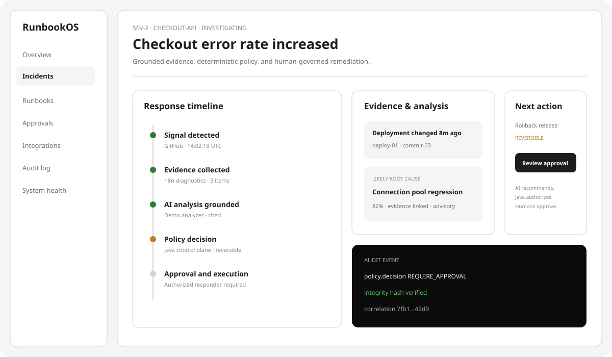
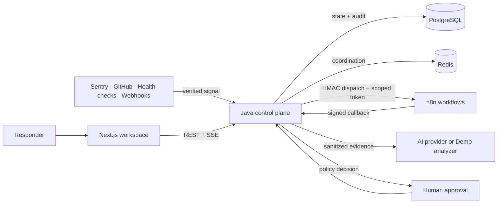

# RunbookOS

### Human-Governed AI Incident Response

[](https://github.com/vaibhav7506/Runbookos/actions/workflows/ci.yml)
[](https://adoptium.net/)
[](https://spring.io/projects/spring-boot)
[](https://nextjs.org/)
[](LICENSE)

RunbookOS receives production incident signals, collects bounded diagnostic evidence, produces evidence-linked AI analysis, recommends reviewed runbooks, and coordinates remediation with deterministic policy and human approval.

The core principle is simple:

> AI recommends. Java authorizes. Humans approve. n8n orchestrates.

RunbookOS is a portfolio-grade reference implementation for secure incident automation. It is fully useful in a credential-free Demo Mode and does not execute destructive production actions.



## What it demonstrates

- Java 21 and Spring Boot control-plane engineering
- Explicit incident and execution state machines
- Organization-isolated multi-tenancy and backend-enforced RBAC
- Evidence-grounded AI with citations, budgets, provider fallback, and prompt-injection defenses
- Versioned runbooks and a deterministic action-risk policy engine
- Human and elevated two-person approval flows
- Transactional outbox delivery, idempotency, circuit breakers, retries, bulkheads, and dead letters
- Signed Spring Boot ↔ n8n communication with scoped execution tokens and replay protection
- Hash-chained audit events and complete incident replay
- A responsive Next.js operational workspace with strong accessibility
- Prometheus metrics, OpenTelemetry tracing, Grafana dashboards, Docker, and GitHub Actions

## Key capabilities

| Area | Capabilities |
|---|---|
| Incident intake | Sentry-style, GitHub deployment, custom HMAC webhook, health-check, and deterministic demo signals |
| Triage | Validation, redaction, delivery idempotency, fingerprinting, deduplication, grouping, severity, ownership, comments, and search |
| Evidence | Recent deployments, repository changes, logs, health checks, issues, and previous context through bounded n8n workflows |
| AI analysis | OpenAI, Anthropic, Gemini, Groq, OpenAI-compatible endpoints, and zero-cost deterministic Demo Mode |
| Governance | Versioned runbooks, policy preview, role checks, read-only auto-allow, reversible approval, elevated approval, and prohibited-action denial |
| Integrations | GitHub, Sentry-compatible webhooks, Slack, email, Jira-compatible issues, signed custom webhooks, and safe HTTP health checks |
| Reliability | Transactional outbox, exponential retry, Resilience4j circuit breakers/bulkheads, backpressure, dead-letter inspection, and redrive |
| Security | Tenant isolation, short JWTs, rotating refresh sessions, BCrypt, AES-GCM secrets, SSRF protection, rate limits, HMAC, and audit integrity |
| Operations | Health dashboard, structured logs, correlation IDs, metrics, traces, Prometheus, Grafana, backup/restore, and recovery runbooks |

## Why Java and n8n are separate

Spring Boot is the authoritative control plane. It owns identity, tenant access, policy, incident state, approval validity, secret access, persistence, and audit. n8n is a bounded orchestration worker for diagnostics, notifications, and already-authorized named actions.

n8n never becomes an authorization system. A dispatch contains a short-lived token scoped to one organization, execution, nonce, and explicit action identifiers. Every callback is signed, replay protected, and revalidated by Java.



### Incident data flow

1. Verify signature, timestamp, nonce, content type, and payload size.
2. Redact secrets and normalize the source payload.
3. Enforce delivery idempotency, fingerprint the event, and group it into an incident.
4. Commit execution intent and an outbox event in one transaction.
5. Collect bounded evidence through signed n8n workflows.
6. Sanitize evidence and validate structured, citation-bearing model output.
7. Evaluate each proposed action in the Java policy engine.
8. Pause reversible or high-risk actions for an eligible human decision.
9. Execute only the approved action identifier and persist every step.
10. Monitor recovery, resolve the incident, and generate a postmortem.

More detail: [system design](docs/architecture/system-design.md), [data model](docs/architecture/data-model.md), and [workflow boundaries](docs/architecture/workflow-boundaries.md).

## Repository layout

```text
apps/web/                    Next.js application
services/control-plane/      Spring Boot control plane
automation/n8n/              Versioned n8n workflows and email templates
packages/api-client/         Generated TypeScript OpenAPI contract
infra/docker/                Database and reverse-proxy assets
infra/observability/         Prometheus and Grafana configuration
docs/                        Architecture, security, demo, API, and operations
scripts/                     Cross-platform development and validation scripts
.github/workflows/           CI security, test, build, and E2E pipeline
```

## Quick start — complete Docker stack

### Prerequisites

- [Git](https://git-scm.com/)
- [Docker Desktop](https://www.docker.com/products/docker-desktop/) with Docker Compose v2
- 8 GB free memory recommended while building all images

No Java, Node.js, AI key, or external integration credential is required for this path.

### Windows PowerShell / VS Code terminal

```powershell
git clone https://github.com/vaibhav7506/Runbookos.git
Set-Location Runbookos
Copy-Item .env.example .env
docker compose up -d --build
docker compose ps
```

### macOS, Linux, Git Bash, or WSL

```bash
git clone https://github.com/vaibhav7506/Runbookos.git
cd Runbookos
cp .env.example .env
docker compose up -d --build
docker compose ps
```

First build can take several minutes. Wait until `control-plane` and `web` are healthy, then open:

- Application: [http://localhost:3000](http://localhost:3000)
- Control-plane health: [http://localhost:8080/api/health](http://localhost:8080/api/health)
- OpenAPI UI: [http://localhost:8080/api/swagger-ui](http://localhost:8080/api/swagger-ui)
- n8n: [http://localhost:5678](http://localhost:5678)

Local n8n credentials are `admin` / `runbookos_local_n8n_password`. These are development-only values from `.env.example`.

Stop the stack without deleting data:

```powershell
docker compose stop
```

Stop and remove containers while retaining named volumes:

```powershell
docker compose down
```

Reset all local RunbookOS data:

```powershell
docker compose down --volumes
```

The last command permanently removes the local PostgreSQL, Redis, and n8n volumes.

## Exact VS Code development commands

Use this mode for frontend and backend hot reload.

### Required local tools

- Java 21 (`java -version`)
- Node.js 22.13 or newer (`node --version`)
- Docker Desktop (`docker version`)
- VS Code with the Extension Pack for Java and ESLint extensions recommended

Open the cloned `Runbookos` directory in VS Code, then create three PowerShell terminals.

### Terminal 1 — PostgreSQL, Redis, and n8n

```powershell
Copy-Item .env.example .env -ErrorAction SilentlyContinue
docker compose up -d postgres redis n8n
docker compose ps
```

### Terminal 2 — Spring Boot control plane

```powershell
Set-Location services/control-plane
$env:POSTGRES_HOST="localhost"
$env:POSTGRES_PORT="5432"
$env:POSTGRES_DB="runbookos"
$env:POSTGRES_USER="runbookos"
$env:POSTGRES_PASSWORD="runbookos_local_password"
$env:REDIS_HOST="localhost"
$env:REDIS_PORT="6379"
$env:JWT_SECRET="local-development-jwt-secret-change-before-production-0123456789"
$env:ENCRYPTION_KEY="AAAAAAAAAAAAAAAAAAAAAAAAAAAAAAAAAAAAAAAAAAA="
$env:INTERNAL_HMAC_SECRET="local-development-hmac-secret-change-before-production"
$env:REFRESH_COOKIE_SECURE="false"
$env:N8N_BASE_URL="http://localhost:5678"
.\gradlew.bat bootRun
```

### Terminal 3 — Next.js web application

```powershell
Set-Location apps/web
npm ci
$env:NEXT_PUBLIC_API_URL="http://localhost:8080"
npm run dev
```

Open [http://localhost:3000](http://localhost:3000). Changes under `apps/web/src` refresh automatically. Restart `bootRun` after Java changes when Spring DevTools cannot reload them.

### Rebuild only one Docker service

```powershell
docker compose up -d --build control-plane
docker compose up -d --build web
```

### Useful diagnostics

```powershell
docker compose ps
docker compose logs --tail=200 control-plane
docker compose logs --tail=200 web
Invoke-RestMethod http://localhost:8080/api/health | ConvertTo-Json -Depth 5
```

## Demo Mode

There are no hardcoded application accounts. Create an account with any valid personal or work email address and a password of 12–128 characters.

1. Open the application and select **Get Started**.
2. Create an account and a Demo Mode organization.
3. Open **Getting Started** and launch the demo incident.
4. Inspect the checkout incident’s signals and evidence.
5. Run the deterministic evidence-grounded analysis.
6. Review a starter runbook and its policy preview.
7. Advance the incident through the governed lifecycle.
8. Review execution, approval, audit, and operational-health screens.
9. Resolve the incident and generate the printable postmortem.

Demo Mode uses no paid API and never performs a destructive action. High-risk operations are denied.

See the [five-minute demo script](docs/demo/demo-script.md).

## Environment configuration

`.env.example` contains valid development-only placeholders. Do not reuse them outside local development.

| Variable | Purpose |
|---|---|
| `POSTGRES_*` | RunbookOS and n8n PostgreSQL connectivity |
| `REDIS_*` | Cache, coordination, rate limiting, and n8n queue connectivity |
| `JWT_SECRET` | Signs short-lived access tokens; use at least 64 random characters |
| `ENCRYPTION_KEY` | Base64-encoded 32-byte AES key for integration credentials |
| `INTERNAL_HMAC_SECRET` | Signs Java ↔ n8n messages; use at least 32 random characters |
| `N8N_ENCRYPTION_KEY` | Stable key protecting n8n credentials; back it up separately |
| `REFRESH_COOKIE_SECURE` | `false` only for local HTTP; must be `true` under TLS |
| `CORS_ALLOWED_ORIGINS` | Exact trusted web origins |
| `OTEL_EXPORTER_OTLP_ENDPOINT` | Optional OTLP trace collector endpoint |
| `NEXT_PUBLIC_API_URL` | Browser-visible control-plane base URL; never place secrets here |

Production variables are listed in `.env.production.example`. Prefer a managed secret store over plaintext environment files.

## AI provider setup

Demo Mode is configured automatically. To use a remote provider:

1. Sign in as an owner or administrator.
2. Open **Settings**.
3. Select OpenAI, Anthropic, Gemini, Groq, or OpenAI-compatible.
4. Enter the model, API key, priority, timeout, retry, token, and cost limits.
5. Save the configuration; only a non-reversible fingerprint is shown afterward.

Provider keys are encrypted at rest. Evidence is recursively redacted before any provider call. Invalid citations, unsupported evidence identifiers, unmarked hypotheses, malformed structured output, and budget violations are rejected.

## Integration setup

Open **Integrations**, choose the connector and environment, review its permission explanation, and use either a transparent demo adapter or a real credential.

- GitHub supports live validation and repository/deployment/commit/issue capabilities.
- Sentry-compatible sources use signed webhook ingestion.
- Slack and email deliver incident and approval notifications.
- Jira-compatible integrations create issues only after policy authorization.
- Custom webhooks use HMAC signatures.
- HTTP health checks allow only validated TLS destinations and block private, loopback, link-local, credential-bearing, and unsafe redirect targets.

Exported n8n workflows live in `automation/n8n/workflows`. Review, import, configure credentials, and activate only the workflows needed for an environment.

## Testing

### Backend

```powershell
Set-Location services/control-plane
.\gradlew.bat spotlessCheck test build
```

The suite covers policy, authorization, state machines, approval rules, tenant isolation, JWTs, HMAC, SSRF, resilience, outbox/dead letters, external HTTP boundaries, registration, optimistic-lock guards, health, and clean PostgreSQL migrations.

### Frontend

```powershell
Set-Location apps/web
npm ci
npm run format:check
npm run lint
npm run type-check
npm test
npm run build
```

### Playwright end-to-end

Start the complete Docker stack first, then:

```powershell
Set-Location apps/web
npm run test:e2e:install
npm run test:e2e
```

The E2E suite covers desktop and mobile onboarding, organization setup, demo incident creation, grounded analysis, incident-state progression, postmortem generation, and WCAG checks.

### Workflow and AI evaluation

```powershell
Set-Location ../..
node scripts/validate-workflows.mjs
node scripts/evaluate-analysis.mjs
```

### Generated API contract

```powershell
Set-Location services/control-plane
.\gradlew.bat syncApiContract
Set-Location ../../packages/api-client
npm ci
npm run generate
```

## Security model

- Backend-authoritative organization isolation and role enforcement
- BCrypt password hashing, short JWT access tokens, rotating hashed refresh sessions
- AES-256-GCM credential encryption with key identifiers and revocation
- Java policy authorization before every executable action
- One- or two-person approvals depending on risk
- Exact typed confirmation and reason for high-risk actions
- Permanent denial of prohibited actions and high-risk denial in Demo Mode
- HMAC signatures, timestamp tolerance, nonce replay protection, and scoped execution tokens
- Request-size, content-type, validation, rate-limit, CORS, security-header, and SSRF controls
- External content and model output treated as untrusted
- Hash-chained, searchable audit records with correlation identifiers
- No secret values returned after creation

Read the [threat model](docs/security/threat-model.md), [approval model](docs/security/approval-model.md), [secret handling guide](docs/security/secret-handling.md), and [security policy](SECURITY.md).

## Observability and operations

Spring Boot exposes health, Prometheus metrics, structured logs, correlation IDs, and OpenTelemetry traces. The repository includes a Prometheus scrape configuration, a provisioned Grafana dashboard, an operational-health UI, dead-letter inspection, and audited redrive.

- [Deployment guide](docs/operations/deployment.md)
- [Backup and restore](docs/operations/backup-restore.md)
- [Platform incident recovery](docs/operations/incident-recovery.md)
- [Reliability and observability](docs/operations/reliability-observability.md)

## Production deployment

The production example provides private data networks, required secrets, non-root application containers, health checks, graceful shutdown, nginx TLS termination, an n8n queue worker, and optional observability services.

```bash
cp .env.production.example .env.production
# Replace every placeholder and provide fullchain.pem + privkey.pem in TLS_CERT_DIR.
docker compose --env-file .env.production -f docker-compose.production.yml config
docker compose --env-file .env.production -f docker-compose.production.yml up -d --build
```

For Prometheus and Grafana:

```bash
docker compose --env-file .env.production -f docker-compose.production.yml \
  --profile observability up -d --build
```

Use a managed PostgreSQL service and secret manager for serious deployments. Run and verify backups before applying Flyway migrations. Kubernetes is intentionally not part of the initial architecture.

## CI pipeline

GitHub Actions performs:

1. Gitleaks secret scanning
2. Trivy dependency and filesystem scanning
3. Backend format, compile, unit, integration, and Testcontainers tests
4. Frontend formatting, lint, strict type checking, component tests, and production build
5. n8n workflow validation and deterministic AI evaluation
6. Production Docker image builds
7. Playwright end-to-end smoke and accessibility testing

## Known limitations

- GitHub is the only connector with live validation in the credential-free reference environment; other connectors expose honest demo adapters until credentials are supplied.
- Exported n8n workflows must be reviewed, imported, credentialed, and activated for live external execution.
- Demo Mode uses deterministic analysis and simulated safe actions.
- High-risk actions are deliberately disabled in Demo Mode; prohibited actions never execute.
- Provider quality and latency vary, so structured validation and fallback remain necessary.
- The included production Compose topology is a reference deployment, not a managed cloud platform.
- No Kubernetes manifests are included; Kubernetes remains an optional future target.

## Roadmap

The ten-phase portfolio scope is complete. Logical next steps are organization invitations, SSO/OIDC, richer service ownership, live Sentry/Slack/Jira certification, long-term audit archiving, managed-cloud deployment templates, and optional Kubernetes/Helm packaging.

## Documentation index

- [Architecture](ARCHITECTURE.md)
- [Project plan](PROJECT_PLAN.md)
- [OpenAPI](docs/api/openapi.md)
- [n8n workflows](automation/n8n/README.md)
- [Contributing](CONTRIBUTING.md)
- [Security](SECURITY.md)
- [Final audit](FINAL_AUDIT.md)

## Portfolio summary

Suggested GitHub description:

> Human-governed AI incident response platform built with Java 21, Spring Boot, Next.js, n8n, PostgreSQL, and deterministic policy enforcement.

Suggested topics:

`java` · `spring-boot` · `nextjs` · `typescript` · `n8n` · `incident-response` · `sre` · `devops` · `ai` · `human-in-the-loop` · `postgresql` · `docker`

Suggested résumé bullets:

- Built a multi-tenant incident-response control plane in Java 21/Spring Boot with explicit state machines, deterministic policy authorization, two-person approvals, and integrity-protected audit events.
- Designed signed, replay-protected orchestration between Spring Boot and n8n using transactional outbox delivery, scoped execution tokens, retries, circuit breakers, and dead-letter redrive.
- Implemented evidence-grounded multi-provider AI analysis with citation validation, prompt-injection defenses, encrypted BYOK credentials, token/cost budgets, and deterministic Demo Mode.
- Delivered a strict-TypeScript Next.js operational UI, generated OpenAPI client, WCAG-focused workflows, Testcontainers/WireMock/Vitest/Playwright coverage, observability, and production Docker deployment assets.

## Contributing

Read [CONTRIBUTING.md](CONTRIBUTING.md), create a focused branch, include tests, update generated contracts where necessary, and run the relevant backend, frontend, workflow, and E2E gates before opening a pull request.

## License

RunbookOS is available under the [MIT License](LICENSE).
