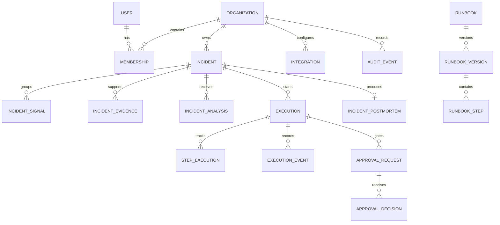

# Data model

RunbookOS stores authoritative control-plane state in PostgreSQL. Every organization-owned aggregate carries an `organization_id`; service and repository queries require that identifier.

UUIDs are used throughout and timestamps are UTC. Published runbook versions and audit events are immutable. Executions, incidents, approvals, integrations, and refresh sessions use optimistic or explicit state validation where concurrent decisions matter. Flyway owns schema evolution; released migrations are never edited.

Sensitive values are separated from normal integration metadata. Credential ciphertext uses AES-GCM, stores its nonce and key identifier, and is never returned through response DTOs.
