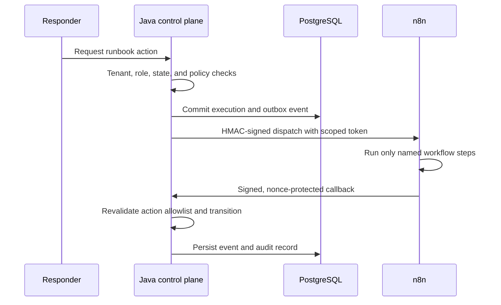

# Workflow boundaries

Spring Boot is the control plane; n8n is an orchestration worker. This is a security boundary, not merely a deployment choice.

The Java service owns identity, authorization, policy, incident and execution state, approval validity, secret access, audit integrity, and idempotency. n8n owns bounded evidence collection, notification delivery, provider coordination, and execution of already-authorized named actions.

n8n cannot change policy, invent action identifiers, approve an action, or treat workflow success as authorization. Dispatch tokens expire quickly and contain only the organization, execution, nonce, and allowed action identifiers. Every callback is independently signed and replay protected.
